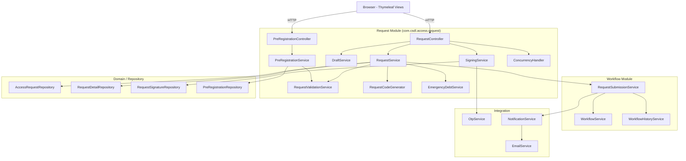
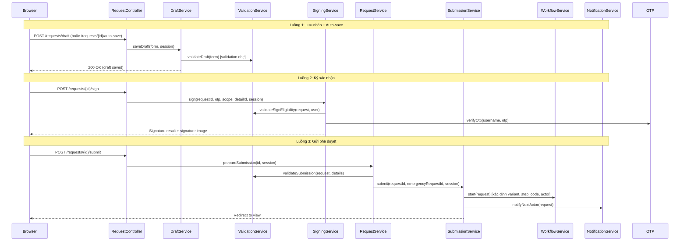
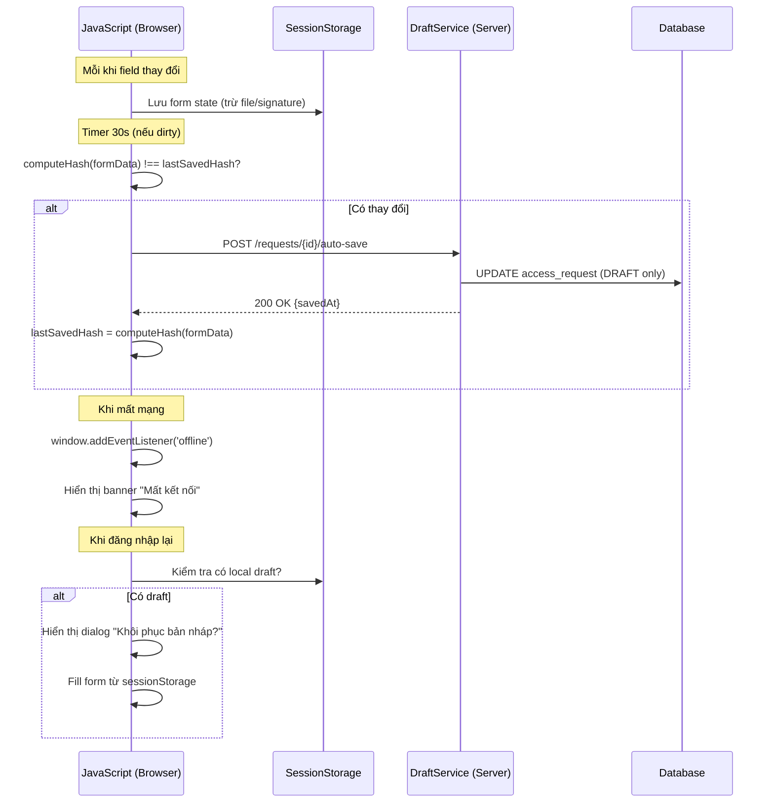

# Design Document — request-create

## Overview

Thiết kế kỹ thuật cho tính năng "Lập và gửi yêu cầu truy cập CSDL" — bao gồm 7 mẫu phiếu (01-YCTC, 02-YCCS, 03-YCCT, 04A-YCTK, 04B-BGTK, 05A-YCKC, 05B-HTKC), cơ chế lưu nháp/auto-save, ký xác nhận OTP, gửi phê duyệt với khởi tạo workflow, xử lý đồng thời nhiều người ký, và đăng ký trước yêu cầu chi tiết.

### Quyết định thiết kế chính

| Quyết định | Lý do |
|---|---|
| Mở rộng `RequestController` + `RequestService` hiện tại thay vì tạo mới | Giữ nguyên kiến trúc monolith, tận dụng code đã có |
| Tách validation thành `RequestValidationService` riêng | Validation phức tạp với 15+ rules, cần testable độc lập |
| Tách signing thành `SigningService` | Tái sử dụng logic ký cho cả requester, co-signer, và receiver (04B) |
| Tách draft thành `DraftService` | Auto-save 30s + dirty check cần logic riêng biệt |
| Tách pre-registration thành sub-module riêng | Luồng nghiệp vụ khác biệt, có CRUD + cron job riêng |
| Sử dụng polling thay vì WebSocket | Phù hợp kiến trúc MVC + Thymeleaf, đơn giản hóa triển khai |
| Row-level locking bằng `@Version` + optimistic locking | Phù hợp JPA/Hibernate, tránh deadlock |

---

## Architecture

### Sơ đồ tương tác thành phần



### Luồng xử lý chính (Sequence)



---

## Components and Interfaces

### 1. RequestController (mở rộng)

Controller MVC xử lý tất cả HTTP request liên quan đến lập/sửa/ký/gửi/hủy yêu cầu.

```java
@Controller
@RequestMapping("/requests")
public class RequestController {

    // === Endpoints hiện tại (giữ nguyên) ===
    // GET  /requests              → myRequests
    // GET  /requests/new          → chooseType
    // GET  /requests/new/{type}   → newForm
    // POST /requests/draft        → createDraft
    // GET  /requests/{id}/edit    → editForm
    // POST /requests/{id}/draft   → updateDraft
    // POST /requests/{id}/sign    → sign
    // POST /requests/{id}/submit  → submit
    // POST /requests/{id}/cancel  → cancel
    // POST /requests/{id}/resend  → resend
    // GET  /requests/{id}         → view

    // === Endpoints mới ===

    // Auto-save (AJAX, không reload trang)
    @PostMapping("/{id}/auto-save")
    @ResponseBody
    public ResponseEntity<AutoSaveResponse> autoSave(
            @PathVariable Long id, @RequestBody RequestForm form);

    // Polling: lấy trạng thái ký mới nhất (cho phiếu chung nhiều người)
    @GetMapping("/{id}/signing-status")
    @ResponseBody
    public ResponseEntity<SigningStatusResponse> signingStatus(@PathVariable Long id);

    // Upload file SQL (02, 03)
    @PostMapping("/{id}/upload-script")
    @ResponseBody
    public ResponseEntity<FileUploadResponse> uploadScript(
            @PathVariable Long id, @RequestParam MultipartFile file);

    // Xóa dòng chi tiết chưa ký (người lập xóa)
    @DeleteMapping("/{id}/details/{detailId}")
    @ResponseBody
    public ResponseEntity<Void> deleteUnsignedDetail(
            @PathVariable Long id, @PathVariable Long detailId);

    // Lấy danh sách 04A nợ (cho 04B)
    @GetMapping("/pending-04a")
    @ResponseBody
    public ResponseEntity<List<RequestSummaryDto>> pending04A();

    // Lấy danh sách 05A nợ gộp (cho 05B)
    @GetMapping("/pending-05a-groups")
    @ResponseBody
    public ResponseEntity<List<EmergencyGroupDto>> pending05AGroups();
}
```

### 2. PreRegistrationController (mới)

```java
@Controller
@RequestMapping("/pre-registrations")
public class PreRegistrationController {

    // GET  /pre-registrations           → Danh sách đăng ký của user hiện tại (phân trang)
    // POST /pre-registrations           → Tạo mới + ký OTP
    // GET  /pre-registrations/{id}/edit → Form sửa
    // POST /pre-registrations/{id}      → Cập nhật + ký lại OTP
    // DELETE /pre-registrations/{id}    → Xóa vĩnh viễn (chỉ khi "Chưa dùng")
    // POST /pre-registrations/clone     → Nhân bản sang ngày/ca khác
    
    // AJAX: Lấy dữ liệu đăng ký trước theo unit + date + shift (cho form 01)
    @GetMapping("/load")
    @ResponseBody
    public ResponseEntity<List<PreRegistrationDto>> loadForForm(
            @RequestParam String unitCode,
            @RequestParam @DateTimeFormat(pattern="yyyy-MM-dd") LocalDate date,
            @RequestParam int shift,
            @RequestParam String requestType);
}
```

### 3. DraftService (mới)

```java
@Service
public class DraftService {

    /**
     * Lưu nháp thủ công (nút "Lưu nháp").
     * Tạo mới entity nếu chưa có, hoặc cập nhật nếu đã có.
     */
    AccessRequest saveDraft(RequestForm form, UserSession session);

    /**
     * Auto-save server-side (gọi mỗi 30s từ JS).
     * Chỉ lưu khi có thay đổi (dirty check dựa trên hash content).
     * Không throw exception — trả về status silently.
     */
    AutoSaveResult autoSave(Long requestId, RequestForm form, UserSession session);

    /**
     * Kiểm tra xem có draft trên server cho user hiện tại không.
     * Dùng khi user đăng nhập lại sau disconnect.
     */
    List<DraftInfo> findDraftsForUser(Long userId);
}
```

### 4. RequestValidationService (mới)

```java
@Service
public class RequestValidationService {

    /**
     * Validate đầy đủ trước khi cho phép ký/gửi.
     * Trả về danh sách lỗi (empty = pass).
     */
    List<ValidationError> validateForSubmission(AccessRequest request, List<RequestDetail> details);

    /**
     * Validate nhẹ khi lưu nháp (chỉ kiểm tra format cơ bản).
     */
    List<ValidationError> validateForDraft(RequestForm form);

    /**
     * Kiểm tra nợ 05B.
     */
    boolean hasDebtBlock(Long userId);

    /**
     * Kiểm tra trùng lặp dòng chi tiết.
     * - 01-YCTC: trùng System + DB + Object + User
     * - 04A-YCTK: trùng User
     */
    List<ValidationError> checkDuplicateDetails(RequestType type, List<RequestDetail> details);

    /**
     * Validate file SQL: format tên, kích thước, checksum.
     */
    ValidationError validateScriptFile(MultipartFile file, String checksumType, String checksumValue);

    /**
     * Validate mẫu 03 tab content vs SQL script.
     */
    List<ValidationError> validate03TabContent(AccessRequest request, boolean hasScript, boolean checksumMatch);

    /**
     * Kiểm tra thời gian (date + shift) không quá khứ.
     */
    ValidationError validateTimeNotPast(Integer shiftNo, LocalDate date, RequestType type);
}
```

### 5. SigningService (mới — tách từ RequestService.sign)

```java
@Service
public class SigningService {

    /**
     * Ký xác nhận bằng OTP cho requester hoặc co-signer.
     * Ghi request_signature, hiển thị ảnh chữ ký.
     */
    SignResult signRequest(Long requestId, String otp, SigningScope scope,
                           Long detailId, UserSession session);

    /**
     * Ký nhận tài khoản (04B — receiver ký dòng của mình).
     * Kiểm tra tất cả ký xong → trigger transition sang PENDING_APPROVAL phase 2.
     */
    SignResult signReceipt(Long requestId, Long detailId, String otp, UserSession session);

    /**
     * Kiểm tra user đã ký trên phiếu này chưa (enforce 1 ký/user/phiếu).
     */
    boolean hasAlreadySigned(Long requestId, Long userId);

    /**
     * Kiểm tra tất cả receiver đã ký nhận (04B).
     */
    boolean allReceiversSigned(Long requestId);
}
```

### 6. ConcurrencyHandler (mới)

```java
@Service
public class ConcurrencyHandler {

    /**
     * Lấy trạng thái ký hiện tại của tất cả dòng chi tiết trên phiếu.
     * Dùng cho polling endpoint.
     */
    SigningStatusResponse getSigningStatus(Long requestId);

    /**
     * Thêm dòng chi tiết mới (co-signer thêm dòng của mình).
     * Sử dụng optimistic locking trên request entity.
     */
    RequestDetail addDetailRow(Long requestId, DetailForm form, UserSession session);

    /**
     * Sửa dòng chi tiết của chính user (chưa ký).
     */
    RequestDetail updateOwnDetail(Long requestId, Long detailId,
                                   DetailForm form, UserSession session);

    /**
     * Xóa dòng chưa ký (chỉ người lập được xóa).
     */
    void deleteUnsignedDetail(Long requestId, Long detailId, UserSession session);

    /**
     * Xóa tất cả dòng chưa ký khi người lập ký gửi.
     */
    int removeAllUnsignedDetails(Long requestId);
}
```

### 7. PreRegistrationService (mới)

```java
@Service
public class PreRegistrationService {

    /** CRUD operations */
    Page<PreRegistrationRequest> listByUser(Long userId, Pageable pageable);
    PreRegistrationRequest create(PreRegistrationForm form, UserSession session);
    PreRegistrationRequest update(Long id, PreRegistrationForm form, UserSession session);
    void delete(Long id, UserSession session);
    PreRegistrationRequest clone(Long id, LocalDate targetDate, int targetShift, UserSession session);

    /** Nạp tự động vào phiếu 01 */
    List<PreRegistrationRequest> loadForForm01(String unitCode, LocalDate date,
                                                int shift, String requestType);

    /** Cập nhật status khi phiếu 01 thay đổi trạng thái */
    void markAsPending(List<Long> preRegIds, Long requestId);
    void markAsUsed(Long requestId);
    void revertToUnused(Long requestId);

    /** Cron job: đánh dấu hết hạn */
    @Scheduled(cron = "0 0 * * * *")  // mỗi giờ
    void expireOutdatedRegistrations();
}
```

### 8. RequestCodeGenerator (mở rộng)

```java
@Service
public class RequestCodeGenerator {

    /**
     * Sinh mã theo unit code (01-YCTC, 04A-YCTK).
     * Format: MãĐơnVị_MãPhòng_yyyyMMddHHmmss
     */
    String generateByUnit(Long unitId, Long departmentId);

    /**
     * Sinh mã theo system code (02, 03, 05A, 05B).
     * Format: KýhiệuHệThống_yyyyMMddHHmmss
     */
    String generateBySystem(Long systemId);

    /**
     * Sinh mã 05B đặc biệt (consolidate "Lần" từ các 05A liên kết).
     * Format: KýhiệuHệThống_yyyyMMdd_Ca_Lan01-02-03
     */
    String generate05B(Long systemId, List<AccessRequest> linked05As);
}
```

---

## Data Models

### Domain Entities (đã có — không thay đổi schema)

Sử dụng các entity hiện có trong `com.csdl.access.domain`:

- `AccessRequest` — header phiếu
- `RequestDetail` — dòng chi tiết
- `RequestScriptFile` — file SQL đính kèm
- `RequestSignature` — chữ ký số
- `EmergencyCompletionLink` — liên kết 05B↔05A
- `WorkflowHistory` — lịch sử workflow

### Entity mới: PreRegistrationRequest

```java
@Entity
@Table(name = "pre_registration_request")
public class PreRegistrationRequest {
    @Id @GeneratedValue(strategy = GenerationType.IDENTITY)
    private Long id;

    @Column(name = "user_id")
    private Long userId;               // app_user.id

    @Column(name = "unit_code")
    private String unitCode;

    @Column(name = "register_date")
    private LocalDate registerDate;

    @Column(name = "shift")
    private Integer shift;             // 1, 2, 3

    @Column(name = "request_type")
    private String requestType;        // "Truy vấn" / "Chỉnh sửa"

    @Column(name = "system_id")
    private Long systemId;

    @Column(name = "database_id")
    private Long databaseId;

    @Column(name = "object_name")
    private String objectName;

    @Column(name = "access_rights")
    private String accessRights;       // CSV: "SELECT,INSERT,UPDATE"

    @Column(name = "signed_at")
    private LocalDateTime signedAt;

    @Column(name = "signature_image_id")
    private Long signatureImageId;

    @Column(name = "status")
    private String status;             // UNUSED, PENDING_APPROVAL, USED, EXPIRED

    @Column(name = "request_id")
    private Long requestId;            // FK → access_request.id (nullable)

    @Column(name = "created_at")
    private LocalDateTime createdAt;

    @Column(name = "updated_at")
    private LocalDateTime updatedAt;

    @Version
    private Integer version;           // Optimistic locking
}
```

### DTOs

```java
/** Response cho auto-save AJAX */
public record AutoSaveResponse(boolean success, String message, LocalDateTime savedAt) {}

/** Response cho polling trạng thái ký */
public record SigningStatusResponse(
    Long requestId,
    List<DetailSigningStatus> details,
    LocalDateTime lastUpdated
) {}

public record DetailSigningStatus(
    Long detailId,
    Long targetUserId,
    String targetUserName,
    boolean signed,
    LocalDateTime signedAt,
    String signatureImageUrl
) {}

/** Response cho upload file */
public record FileUploadResponse(
    boolean success,
    String fileName,
    long fileSize,
    String computedChecksum,
    String checksumType
) {}

/** Kết quả ký */
public record SignResult(
    boolean success,
    String message,
    String signatureImageUrl,
    LocalDateTime signedAt
) {}

/** Thông tin nhóm 05A cho 05B */
public record EmergencyGroupDto(
    Long systemId,
    String systemName,
    Long databaseId,
    String databaseName,
    LocalDate date,
    Integer shift,
    List<Long> requestIds,
    List<String> accessNos,
    List<DetailSummaryDto> unionDetails
) {}

/** Lỗi validation */
public record ValidationError(
    String field,
    String code,
    String message
) {}
```

### Repository mới

```java
public interface PreRegistrationRepository extends JpaRepository<PreRegistrationRequest, Long> {
    
    Page<PreRegistrationRequest> findByUserIdOrderByCreatedAtDesc(Long userId, Pageable pageable);
    
    List<PreRegistrationRequest> findByUnitCodeAndRegisterDateAndShiftAndStatus(
            String unitCode, LocalDate date, int shift, String status);
    
    List<PreRegistrationRequest> findByUnitCodeAndRegisterDateAndShiftAndStatusAndRequestType(
            String unitCode, LocalDate date, int shift, String status, String requestType);
    
    List<PreRegistrationRequest> findByRequestId(Long requestId);
    
    @Modifying
    @Query("UPDATE PreRegistrationRequest p SET p.status = :status WHERE p.requestId = :requestId")
    int updateStatusByRequestId(@Param("requestId") Long requestId, @Param("status") String status);
    
    @Modifying
    @Query("UPDATE PreRegistrationRequest p SET p.status = 'EXPIRED' " +
           "WHERE p.status = 'UNUSED' AND (p.registerDate < :today " +
           "OR (p.registerDate = :today AND p.shift < :currentShift))")
    int expireOutdated(@Param("today") LocalDate today, @Param("currentShift") int currentShift);
    
    boolean existsByUserIdAndRegisterDateAndShiftAndSystemIdAndDatabaseIdAndObjectNameAndAccessRights(
            Long userId, LocalDate date, int shift, Long systemId, Long databaseId,
            String objectName, String accessRights);
}
```

### Mở rộng RequestDetailRepository

```java
public interface RequestDetailRepository extends JpaRepository<RequestDetail, Long> {
    // Existing
    List<RequestDetail> findByRequestId(Long requestId);
    List<RequestDetail> findByTargetUserId(Long userId);
    void deleteByRequestId(Long requestId);
    
    // Mới — cho concurrency
    @Modifying
    @Query("DELETE FROM RequestDetail d WHERE d.requestId = :requestId " +
           "AND d.id NOT IN (SELECT s.detailId FROM RequestSignature s WHERE s.requestId = :requestId AND s.detailId IS NOT NULL AND s.result = 'SUCCESS')")
    int deleteUnsignedByRequestId(@Param("requestId") Long requestId);
    
    int countByRequestId(Long requestId);
}
```

---

## Correctness Properties

*A property is a characteristic or behavior that should hold true across all valid executions of a system — essentially, a formal statement about what the system should do. Properties serve as the bridge between human-readable specifications and machine-verifiable correctness guarantees.*


### Property 1: Chặn nợ 05B — Debt blocking

*For any* user with outstanding 05B debt exceeding 3 days and *for any* request type other than 05B-HTKC, attempting to create a new request SHALL be blocked.

**Validates: Requirements 1.4**

### Property 2: Draft round-trip persistence

*For any* valid RequestForm data, saving as draft and then reading back the persisted entity SHALL produce equivalent field values (excluding auto-generated fields like id, requestCode, createdAt).

**Validates: Requirements 2.1**

### Property 3: Dirty check detection

*For any* two RequestForm states (current and previous), the dirty check SHALL return true if and only if at least one non-excluded field differs between them.

**Validates: Requirements 2.2**

### Property 4: Status-based action guard

*For any* request status, the system SHALL allow edit/cancel only when status is in {DRAFT, PENDING_SIGN, RETURNED}, and SHALL block edit/cancel for all other statuses (PENDING_APPROVAL, PENDING_CHECK, PENDING_ACCESS_TEAM, COMPLETED, CANCELLED).

**Validates: Requirements 2.5, 2.6, 20.1, 20.2, 20.3**

### Property 5: Request code format correctness

*For any* valid combination of request type, unit, system, shift, and date, the generated request code SHALL match the expected regex pattern for that request type (unit-based for 01/04A, system-based for 02/03/05A/05B).

**Validates: Requirements 3.1, 3.2, 3.3**

### Property 6: One signature per user per request

*For any* user who has already successfully signed a request, a subsequent signing attempt on the same request SHALL be rejected.

**Validates: Requirements 4.5**

### Property 7: Signed row immutability

*For any* detail row that has a successful signature record, any attempt to modify or delete that row SHALL be rejected regardless of who attempts the modification.

**Validates: Requirements 4.4, 6.4, 19.4**

### Property 8: Mandatory field validation completeness

*For any* form submission where at least one mandatory field (as defined per form type) is empty or null, the validation engine SHALL return at least one validation error referencing that field.

**Validates: Requirements 5.1, 10.1**

### Property 9: Variant determination correctness

*For any* request where requester_unit_id equals the information system's owner_unit_id, the variant SHALL be Internal (I). *For any* request where they differ, the variant SHALL be External (E). For types without variant (03, 05A), variant SHALL be null.

**Validates: Requirements 5.2, 14.1, 14.2, 14.3**

### Property 10: Workflow initialization correctness

*For any* submitted request, the system SHALL set current_step_code matching format `{TYPE}_{VARIANT}_{01}` (or `{TYPE}_{01}` without variant), set at_requester_phase according to the variant/step mapping, resolve a non-null current_actor_role and current_unit_id, and create a workflow_history record with action=SUBMIT.

**Validates: Requirements 5.3, 14.4, 14.5, 14.6, 14.7**

### Property 11: File name format validation

*For any* file name string, the validation SHALL accept if and only if the string matches the pattern `YYYYMMDD_BS_XXX.sql` (where YYYY is 4-digit year, MM is valid month, DD is valid day, BS is alphanumeric, XXX is 3-digit number).

**Validates: Requirements 5.5**

### Property 12: Checksum verification

*For any* file content and checksum type (MD5/SHA-256), the computed hash of the file SHALL match the user-provided checksum string if and only if the provided string is the correct hex-encoded hash. Format validation: MD5 must be exactly 32 hex characters, SHA-256 must be exactly 64 hex characters.

**Validates: Requirements 5.6, 5.7, 10.8**

### Property 13: Submission removes unsigned detail rows

*For any* multi-signer request (01-YCTC, 04A-YCTK) at submission time, all detail rows without a successful signature SHALL be removed, and only signed rows SHALL remain in the persisted request.

**Validates: Requirements 6.5, 13.1, 13.2**

### Property 14: Duplicate detail detection

*For any* set of detail rows on a request, the validator SHALL detect duplicates: for 01-YCTC, any two rows with identical (systemId, databaseId, objectName, targetUserId); for 04A-YCTK, any two rows with identical targetUserId.

**Validates: Requirements 10.4, 10.5**

### Property 15: Date+shift past-time blocking

*For any* request type other than 04B-BGTK and 05B-HTKC, selecting a date+shift combination that has already passed SHALL be rejected by validation. For 04B and 05B, past date+shift SHALL be allowed.

**Validates: Requirements 10.6, 16.3**

### Property 16: Single system+database enforcement

*For any* request of type 02-YCCS, 03-YCCT, 04A-YCTK, or 05A-YCKC, the validation SHALL require exactly one systemId and one databaseId to be selected (not null, not multiple).

**Validates: Requirements 10.2**

### Property 17: 04A filtering for 04B creation

*For any* set of 04A-YCTK requests, the system SHALL display only those with status=COMPLETED and no existing linked 04B record.

**Validates: Requirements 8.2**

### Property 18: 04B auto-fill data mapping

*For any* completed 04A-YCTK request, creating a 04B-BGTK from it SHALL correctly map: systemId, databaseId, requester info, detail rows (account type, scope, content, owner name) — with UserID field left empty.

**Validates: Requirements 8.3, 8.4**

### Property 19: Receiver signing completion triggers transition

*For any* 04B-BGTK request in PENDING_RECEIPT status, when the last unsigned receiver signs their row (making all receivers signed), the system SHALL automatically transition status to PENDING_APPROVAL for phase 2.

**Validates: Requirements 8.7, 8.8**

### Property 20: 05A grouping for 05B

*For any* set of outstanding 05A-YCKC requests belonging to the same user, the system SHALL group them by (systemId, databaseId, date, shift) and display each group as a single selectable item with the union of all detail tables from the constituent 05A requests.

**Validates: Requirements 9.1, 9.2**

### Property 21: Pre-registration edit/delete status guard

*For any* pre-registration record, edit and delete operations SHALL succeed only when status is "UNUSED" (Chưa dùng). For all other statuses (PENDING_APPROVAL, USED, EXPIRED), edit and delete SHALL be rejected.

**Validates: Requirements 16.5, 16.6**

### Property 22: Pre-registration duplicate blocking

*For any* pre-registration attempt where a record already exists with the same (userId, registerDate, shift, systemId, databaseId, objectName, accessRights), the creation SHALL be rejected.

**Validates: Requirements 16.4**

### Property 23: Pre-registration loading filter correctness

*For any* query to load pre-registrations for form 01-YCTC with parameters (unitCode, date, shift, requestType), the result SHALL contain only records matching all parameters with status="UNUSED". When requestType is "Truy vấn", only records with requestType="Truy vấn" SHALL be loaded. When requestType is "Chỉnh sửa", records of both types SHALL be loaded.

**Validates: Requirements 17.1, 17.2, 17.3**

### Property 24: Pre-registration status lifecycle

*For any* pre-registration records linked to a request: when the request is submitted, their status SHALL change to "PENDING_APPROVAL"; when the request is cancelled, their status SHALL revert to "UNUSED"; when the request completes access grant, their status SHALL change to "USED".

**Validates: Requirements 17.6, 17.7, 17.8**

### Property 25: Pre-registration type change removes incompatible rows

*For any* loaded pre-registration rows on form 01-YCTC, when the request type changes from "Chỉnh sửa" to "Truy vấn", all rows with access_rights containing INSERT, UPDATE, or DELETE SHALL be removed from the form and their pre-registration status SHALL revert to "UNUSED".

**Validates: Requirements 17.5**

### Property 26: Pre-registration expiry

*For any* pre-registration record with status "UNUSED" where register_date + shift is in the past, the expiry process SHALL update status to "EXPIRED".

**Validates: Requirements 18.2**

### Property 27: Only form creator can delete unsigned rows

*For any* user attempting to delete an unsigned detail row on a shared request, the operation SHALL succeed only if the user is the form creator (requester_user_id). Non-creators SHALL be rejected.

**Validates: Requirements 19.5**

### Property 28: Resubmission restarts workflow

*For any* request in RETURNED status that is resubmitted, the system SHALL transition to the appropriate pending status for the form type (same as initial submission) and re-initialize workflow from the beginning step.

**Validates: Requirements 21.2**

---

## Error Handling

### Chiến lược xử lý lỗi theo tầng

| Tầng | Loại lỗi | Xử lý |
|---|---|---|
| Controller | Validation errors | Trả về form view với `BindingResult` errors, hiển thị bằng Thymeleaf |
| Controller | `BusinessException` | Flash message lỗi + redirect về form |
| Controller (AJAX) | Bất kỳ exception | `ResponseEntity` với HTTP 4xx/5xx + JSON error |
| Service | Business rule violation | Throw `BusinessException(message)` |
| Service | Optimistic lock failure | Catch `OptimisticLockException` → throw `BusinessException("Dữ liệu đã bị thay đổi bởi người khác")` |
| Service | OTP verification failure | Throw `BusinessException` với message từ OTP service |
| Repository | Database constraint violation | Catch `DataIntegrityViolationException` → throw `BusinessException` |
| Integration | Email send failure | Log error, không block luồng chính (fire-and-forget via async) |
| Integration | OTP service unavailable | Throw `BusinessException("Dịch vụ xác thực tạm thời không khả dụng")` |

### Retry Logic

```java
/** Cấu hình retry cho submission (network-level) */
@Configuration
public class RetryConfig {
    // Server-side: không retry — client-side JS xử lý retry 3 lần × 5s
    // Server-side chỉ đảm bảo idempotency cho submit action
}
```

**Client-side retry (JavaScript):**
```javascript
async function submitWithRetry(formData, maxRetries = 3, delayMs = 5000) {
    for (let attempt = 1; attempt <= maxRetries; attempt++) {
        try {
            const response = await fetch(url, { method: 'POST', body: formData });
            if (response.status === 401) {
                // Session expired — stop retry
                showSessionExpiredDialog();
                return;
            }
            if (response.ok) return response;
            if (response.status >= 500) throw new Error('Server error');
        } catch (e) {
            if (attempt === maxRetries) {
                showNetworkErrorBanner();
                return;
            }
            await sleep(delayMs);
        }
    }
}
```

### Xử lý Concurrency Conflict

```java
// Khi 2 người cùng sửa 1 dòng (race condition)
@Version
private Integer version;  // trên RequestDetail entity

// Service layer
try {
    detailRepository.save(detail);
} catch (OptimisticLockException e) {
    throw new BusinessException(
        "Dòng chi tiết đã bị thay đổi bởi người khác. Vui lòng tải lại trang.");
}
```

---

## Testing Strategy

### Phân loại test

| Loại | Mục đích | Framework | Số lượng dự kiến |
|---|---|---|---|
| Property-based tests | Kiểm chứng correctness properties (28 properties) | jqwik (Java PBT library) | 28 test classes |
| Unit tests | Kiểm tra edge cases, specific examples, error paths | JUnit 5 + Mockito | ~80 tests |
| Integration tests | Kiểm tra luồng end-to-end với DB + Spring context | Spring Boot Test + H2 | ~25 tests |

### Property-Based Testing Configuration

- **Library:** jqwik 1.8.x (mature Java PBT library, integrates with JUnit 5)
- **Iterations:** Minimum 100 per property test
- **Tag format:** `@Tag("Feature: request-create, Property {N}: {title}")`

### Unit Test Focus Areas

- Validation rules (các edge cases cụ thể: empty string vs whitespace, boundary dates)
- Request code generation (format correctness cho các loại khác nhau)
- Workflow variant determination (internal vs external)
- Checksum computation (MD5, SHA-256 với known test vectors)
- Error handling paths (OTP failure, session expired, file too large)

### Integration Test Focus Areas

- Full submission flow (create draft → sign → submit → verify workflow state)
- Multi-signer flow (user A creates → user B adds row → user B signs → user A submits)
- Pre-registration lifecycle (create → load into form → submit form → verify status)
- Email notification triggers (mock SMTP, verify correct recipients)
- 04B flow (create from 04A → DBA sign → manager approve → receivers sign → auto-transition)
- 05B grouping (multiple 05A → verify correct grouping and union)

### Test Dependencies

```xml
<dependency>
    <groupId>net.jqwik</groupId>
    <artifactId>jqwik</artifactId>
    <version>1.8.3</version>
    <scope>test</scope>
</dependency>
```

---

## Thiết kế chi tiết bổ sung

### Auto-Save Flow (Server-side + Client-side)



### Polling Flow (Concurrency)

```javascript
// Cấu hình polling interval
const POLL_INTERVAL_MS = 5000; // 5 giây

let pollingTimer = null;

function startPolling(requestId) {
    pollingTimer = setInterval(async () => {
        const response = await fetch(`/requests/${requestId}/signing-status`);
        const data = await response.json();
        updateDetailRowsUI(data.details);
    }, POLL_INTERVAL_MS);
}

function stopPolling() {
    if (pollingTimer) clearInterval(pollingTimer);
}
```

### Thymeleaf View Mapping

| URL Pattern | Template | Mô tả |
|---|---|---|
| `/requests` | `requests/list.html` | Danh sách yêu cầu của tôi |
| `/requests/new` | `requests/new.html` | Chọn mẫu phiếu |
| `/requests/new/{type}` | `requests/form.html` | Form nhập liệu (1 template chung, hiển thị conditional theo type) |
| `/requests/{id}/edit` | `requests/form.html` | Sửa nháp (cùng template) |
| `/requests/{id}` | `requests/view.html` | Xem chi tiết (read-only) |
| `/pre-registrations` | `requests/pre-registration/list.html` | Danh sách đăng ký trước |
| `/pre-registrations/new` | `requests/pre-registration/form.html` | Form đăng ký trước |

### Thymeleaf Fragment Strategy

Sử dụng fragments để tái sử dụng UI components giữa các form type:

```
templates/requests/
├── form.html              (layout chính)
├── fragments/
│   ├── header-info.html   (thông tin chung: đơn vị, phòng, người lập, ca, ngày)
│   ├── detail-table-01.html   (bảng chi tiết 01-YCTC)
│   ├── detail-table-04a.html  (bảng chi tiết 04A-YCTK)
│   ├── detail-table-04b.html  (bảng chi tiết 04B-BGTK)
│   ├── file-upload.html       (upload SQL file + checksum)
│   ├── signing-panel.html     (panel ký OTP)
│   ├── readonly-approval.html (phần read-only phê duyệt)
│   ├── readonly-execution.html (phần read-only thực hiện)
│   └── readonly-dba.html     (phần DBA ghi — 03)
├── view.html
├── list.html
├── new.html
└── pre-registration/
    ├── list.html
    └── form.html
```

### Scheduled Jobs

```java
@Configuration
@EnableScheduling
public class SchedulingConfig {}

@Service
public class RequestScheduledTasks {

    private final PreRegistrationService preRegistrationService;
    private final NotificationService notificationService;
    private final AccessRequestRepository requestRepository;

    /** Hết hạn đăng ký trước — mỗi giờ */
    @Scheduled(cron = "0 0 * * * *")
    public void expirePreRegistrations() {
        preRegistrationService.expireOutdatedRegistrations();
    }

    /** Nhắc nhở 04B quá hạn ký nhận — mỗi ngày 8h sáng */
    @Scheduled(cron = "0 0 8 * * *")
    public void remind04BPendingReceipt() {
        LocalDateTime threshold = LocalDateTime.now().minusDays(3);
        List<AccessRequest> overdue = requestRepository
            .findByRequestTypeAndStatusAndSubmittedAtBefore(
                RequestType.BGTK_04B, RequestStatus.PENDING_RECEIPT, threshold);
        for (AccessRequest r : overdue) {
            notificationService.send04BReminder(r);
        }
    }
}
```
